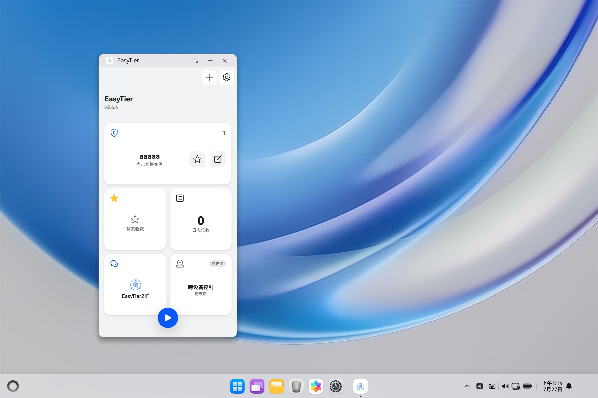

# EasyTier for HarmonyOS PC / NEXT

> 开源软件移植：复用 EasyTier Rust 组网内核，以 ArkTS / ArkUI 原生应用适配鸿蒙 PC（2in1），同时保留手机和平板支持。

[-8A2BE2)](https://developer.harmonyos.com)
[](https://developer.harmonyos.com)
[](https://github.com/EasyTier/EasyTier)
[](#许可证)

## 📖 项目简介

本项目采用 **HarmonyOS 原生壳工程 + EasyTier Rust 内核 HAR** 的混合架构：

- **HarmonyOS 壳工程**：使用 ArkTS、ArkUI、HMRouter 和 HarmonyOS Extension Ability 构建完整客户端界面，负责配置管理、状态展示、系统权限、后台任务、分享、云同步、远端控制和桌面组件等系统集成能力
- **EasyTier 内核层**：通过 `easytier-ohrs` HAR 集成 Rust 原生网络核心，提供 EasyTier 组网、VPN 隧道、运行状态、日志与配置桥接能力
- **系统网络能力**：通过 VPN 扩展入口申请授权，使用 `vpnExtension` 创建系统 TUN 并将 fd 交给 Rust；主进程与扩展进程运行路径按实际运行模式衔接，不把扩展能力声明等同于内核固定运行在扩展进程。

这种架构让 EasyTier 的高性能 Rust 内核能够以原生 HAR 形式嵌入鸿蒙应用，同时让 UI、权限、文件、分享、云同步和设备适配完全走 HarmonyOS 原生能力。

**社区项目仓库：** https://atomgit.com/OpenHarmonyPCDeveloper/ohos_easytier

**Rust 内核适配仓库：** https://atomgit.com/FrankHan2004/EasyTier

**编译运行与 PC 适配说明：** [README.OpenHarmony_CN.md](README.OpenHarmony_CN.md)

### 鸿蒙 PC 完整运行界面



*已有测试记录，原图为 3120×2080，保留系统桌面、任务栏和完整应用窗口，未裁剪或拼接。该截图证明应用已在 PC 桌面启动并展示界面；图中实例尚未启动，不用于证明节点互通或网络性能。*


## 🏗️ 项目结构

```bash
EasyTier/
│
├── AppScope/                         # 应用级配置（包名、图标、版本、云同步）
│   ├── app.json5                     # 应用元信息（bundleName = top.frankhan.easytier）
│   └── resources/
│       └── base/
│           ├── element/              # 应用级字符串资源
│           └── media/                # 应用图标、分层图标、启动图
│
├── entry/                            # 鸿蒙模块：EasyTier 客户端入口
│   ├── src/main/ets/
│   │   ├── AppManager.ets            # 全局应用状态和服务聚合入口
│   │   ├── ConfigSyncUtil.ets        # 配置同步和分享链接处理
│   │   ├── EasyTierUtil.ets          # EasyTier 内核桥接与运行控制
│   │   ├── ToastUtil.ets             # 系统 Toast 封装
│   │   ├── WindowUtil.ets            # 窗口尺寸和布局工具
│   │   │
│   │   ├── entryability/             # Ability 与系统扩展入口
│   │   │   ├── EntryAbility.ets      # 主 UIAbility，应用启动与生命周期
│   │   │   ├── EasyTierAbility.ets   # VPN Extension Ability
│   │   │   ├── EntryFormAbility.ets  # 桌面卡片 Ability
│   │   │   └── StatusBarViewAbility.ets # 状态栏视图 Ability
│   │   │
│   │   ├── entrybackupability/
│   │   │   └── EntryBackupAbility.ets # 备份恢复扩展
│   │   │
│   │   ├── pages/                    # 页面入口
│   │   │   ├── HMRouterIndex.ets     # HMRouter 根页面
│   │   │   ├── StatusBarPage.ets     # 状态栏视图页面
│   │   │   └── hmrouter/
│   │   │       ├── HomePage.ets      # 首页
│   │   │       ├── EditPage.ets      # 配置编辑页
│   │   │       ├── StatusPage.ets    # 本机运行状态页
│   │   │       ├── HelpPage.ets      # 帮助页
│   │   │       ├── RemoteControlPage.ets # 跨端控制入口
│   │   │       ├── RemoteSettingPage.ets # 远端设置页
│   │   │       ├── RemoteStatusPage.ets  # 远端状态页
│   │   │       └── remote/
│   │   │           └── RemoteSummaryViewState.ets
│   │   │
│   │   ├── components/               # ArkUI 组件
│   │   │   ├── index/                # 首页卡片、日志、实例、收藏等组件
│   │   │   ├── sheet/                # 设置页、弹窗和底部面板
│   │   │   ├── edit/                 # 半配置化编辑器
│   │   │   ├── status/               # 状态展示组件
│   │   │   ├── util/                 # 通用按钮、选择器、二维码等组件
│   │   │   └── widgets/              # 桌面卡片页面
│   │   │
│   │   ├── config/                   # 配置渲染和字段 Schema
│   │   │   ├── defaults/             # 默认配置
│   │   │   ├── fields/               # 字段注册与 UI 定义
│   │   │   ├── render/               # 配置编辑渲染计划
│   │   │   └── schema/               # Schema 布局与模型
│   │   │
│   │   ├── infrastructure/bridge/kernel/
│   │   │   ├── KernelBridgeTypes.ets # 内核桥接类型
│   │   │   ├── RouteStore.ets        # 路由/网络状态缓存
│   │   │   ├── SocketCodec.ets       # Socket 数据编解码
│   │   │   └── VpnExtensionSocketBridge.ets
│   │   │
│   │   ├── services/                 # 业务服务层
│   │   │   ├── cloud/                # 云空间同步
│   │   │   ├── config/storage/       # 配置持久化
│   │   │   ├── crash/                # 崩溃日志
│   │   │   ├── data/storage/         # 数据迁移与存储
│   │   │   ├── easytier/runtime/     # EasyTier 启停编排
│   │   │   ├── form/                 # 桌面卡片通信
│   │   │   ├── permission/           # 权限检测与申请
│   │   │   ├── preferences/storage/  # Preferences 封装
│   │   │   ├── remote/               # 跨端控制服务
│   │   │   └── runtime/              # 运行时长与内存统计
│   │   │
│   │   ├── store/                    # UI 状态
│   │   ├── types/                    # 类型定义
│   │   └── util/                     # 分享、事件、信息、转换工具
│   │
│   ├── src/main/resources/           # 模块资源
│   │   ├── base/
│   │   │   ├── element/              # 字符串、颜色、资源定义
│   │   │   ├── media/                # 图片与图标
│   │   │   └── profile/              # 路由、权限、备份、卡片配置
│   │   ├── dark/element/             # 深色模式资源
│   │   ├── rawfile/                  # 原始资源
│   │   └── zh/element/               # 中文资源
│   │
│   ├── build-profile.json5           # 模块构建配置
│   ├── hvigorfile.ts                 # 模块构建脚本
│   ├── obfuscation-rules.txt         # 混淆规则
│   └── oh-package.json5              # 模块依赖配置
│
├── easytier-ohrs-0.0.1.har           # EasyTier Rust 内核 HAR（项目内本地依赖）
├── hmrouter_config.json              # HMRouter 插件配置
├── signing/                          # 签名配置和材料
├── hvigor/                           # Hvigor 配置
│   └── hvigor-config.json5
├── build-profile.json5               # 应用产品、SDK 和模块定义
├── hvigorfile.ts                     # 应用构建脚本入口
├── oh-package.json5                  # 项目级 ohpm 依赖
└── README.md
```

## ✨ 核心功能

| 功能 | 说明 |
|------|------|
| 🔗 **EasyTier 组网** | 通过 Rust 内核 HAR 启动 EasyTier 网络实例 |
| 🛡️ **系统 VPN 隧道** | 经 VPN 扩展入口授权，通过 `vpnExtension` 创建系统 TUN 并注入 Rust 内核 |
| 🧩 **多实例配置管理** | 支持创建、编辑、收藏、重命名和删除多个网络配置 |
| 📥 **配置导入** | 支持分享链接、文件、剪贴板和二维码导入 |
| 📤 **配置导出** | 支持系统分享面板、二维码和配置链接导出 |
| 📊 **运行状态** | 展示虚拟 IP、NAT 类型、TUN 状态、节点信息和运行实例 |
| 🧠 **半配置化编辑器** | 通过 Schema 和字段注册表动态渲染复杂配置项 |
| ☁️ **云空间同步** | 支持配置缓存、上传、下载和同步状态显示 |
| 🖥️ **可重构首页布局** | 首页卡片可拖拽、调整位置和尺寸，适配手机、平板与 2in1 |
| 🧭 **跨端控制** | 管理远端设备的配置、运行状态和基础设置 |
| 🧾 **日志与调试** | 支持内核日志、调试日志、崩溃日志分享和运行统计 |
| 📌 **状态栏视图** | 通过 `StatusBarViewExtensionAbility` 展示轻量连接状态 |
| 🪟 **桌面卡片** | 通过 Form Ability 提供桌面快捷入口和状态展示 |
| 🤲 **握持姿态适配** | 结合手势检测调整关键交互位置，优化单手操作 |
| 🎨 **HDS 原生视觉** | 使用 HDS Navigation、系统符号、动效和鸿蒙资源体系 |

## 🧭 功能适配情况

> 迁移复用的是 EasyTier 的 Rust 网络内核，不是直接运行 Windows/Linux 桌面二进制。界面与系统集成采用 HarmonyOS 原生实现。鸿蒙 PC 与普通 Linux 的权限和网络管理方式不同，不能把 raw socket、直接创建 TUN 等桌面假设原样搬过来。以下状态描述仓库的能力边界，不代表每个系统版本、签名和网络环境都已逐项验收。

| 能力 | 状态 | 说明 |
|------|------|------|
| EasyTier 基础组网 | ✅ 已支持 | 可通过内核 HAR 启动 EasyTier 实例，建立节点与隧道连接 |
| 系统 VPN 隧道接入 | ✅ 已支持 | 经系统授权创建 TUN，Rust 接收 fd 并处理数据转发 |
| 多实例配置管理 | ✅ 已支持 | 支持创建、编辑、收藏、重命名和删除多个网络配置 |
| 配置导入/导出 | ✅ 已支持 | 支持分享链接、文件、剪贴板和二维码导入导出 |
| 运行状态与日志 | ✅ 已支持 | 展示虚拟 IP、NAT 类型、TUN 状态、节点信息与运行日志 |
| 后台运行与通知 | ✅ 已支持 | 支持后台任务、通知提醒和状态栏轻量展示 |
| 云同步与跨端能力入口 | ✅ 已支持 | 提供配置缓存、上传下载和跨端控制入口 |
| 高级路由策略与深度系统控制 | ⚠️ 部分支持 | 目前已支持常见的组网场景；其中 `faketcp` 因 `raw socket` 权限限制无法落地，`ping` 代理因 `icmp socket` 权限限制无法落地 |
| Web 控制台接入 | ❌ 未适配 | 当前客户端不接入该控制台；多配置管理不等于支持多个实例各自创建 TUN，不能承诺上游控制台的完整多实例路径 |

## T0 / T1 / T2：鸿蒙 PC 迁移阶段与能力边界

沿用“基础可用 → 日常核心功能 → PC 平台增强”的三阶段划分。这里的“已支持”指仓库已提供对应实现；完整桌面截图与项目性能记录是已有验证证据，不将其扩展成所有功能的本轮真机验收，也不按条目数量计算迁移完成百分比。

### T0 基础能力：能构建、能启动、能进入组网主流程

| 能力 | 状态 | 迁移内容与验收边界 |
| --- | --- | --- |
| Rust 内核 HAR 接入 | 已支持 | 仓库携带 arm64 HAR，应用通过 NAPI 加载；构建后检查 HAP 内 Native 库与类型声明匹配 |
| HAP 构建、安装与启动 | 已支持 | Hvigor / DevEco 构建签名包；PC 启动后的完整桌面截图见上文 |
| 配置创建与导入 | 已支持 | 手动编辑、链接、文件、剪贴板及二维码入口；验证导入配置与内核语义校验 |
| 系统 VPN 与 TUN | 已支持 | 系统侧授权及创建 TUN，Rust 接收 fd；需验证授权、挂载和停止清理，不把实例启动等同于 TUN 已就绪 |
| 节点与运行状态 | 已支持 | 提供虚拟 IP、Peer、NAT、路由及日志；节点互通须在真实组网环境单独验证 |

T0 验收重点是“签名包可安装 → PC 主界面可见 → 配置可用 → TUN/节点状态可观察”，截图本身只证明启动与窗口化显示。

### T1 核心能力：日常组网、配置维护与问题诊断

| 能力 | 状态 | 迁移内容与验收边界 |
| --- | --- | --- |
| 多配置管理 | 已支持 | 创建、收藏、重命名、复制、删除配置；不等于同时建立多个独立系统 TUN |
| 配置导出与分享 | 已支持 | 文件、链接、二维码及系统分享；验证导出再导入的配置语义 |
| 运行状态与日志 | 已支持 | 内核事件、流量统计、运行采样及崩溃日志；过期状态不应当作当前连通性证明 |
| 切网恢复与启停编排 | 已支持 | 网络变化看护、内核软重启和 TUN 事务衔接；需要切网、连续启停及资源释放回归 |
| 后台运行与通知 | 已支持 | 根据设备和系统能力选择运行保持方案；不承诺任意系统策略下永久常驻 |
| 高级协议 | 部分支持 | 常见 TCP/UDP 组网路径可用；`faketcp` 与 `ping` 代理受 raw/ICMP socket 权限限制 |

T1 验收重点是配置读写闭环、正常启停、切网恢复和可诊断性，不能只检查一个“已连接”布尔值。

### T2 增强能力：PC 窗口、大屏交互与平台集成

| 能力 | 状态 | 迁移内容与验收边界 |
| --- | --- | --- |
| PC 窗口形态 | 已支持 | 模块声明 `2in1`，支持浮窗、分屏和全屏；窗口尺寸变化更新布局 |
| 配置页大屏布局 | 已支持 | 按窗口宽度切换一、二、三栏；逐帧加载与 Native BoolField 成本分析见 `docs/CONFIG_PAGE_PERFORMANCE.md` |
| 首页布局调整 | 已支持 | 卡片拖拽、排序、隐藏、尺寸与位置持久化；PC 鼠标操作与缩放窗口应分别验收 |
| 桌面入口与轻量状态 | 按能力提供 | 桌面卡片、状态栏和运行保持选项受设备类型、API 与系统能力约束，不保证每种桌面都有相同入口 |
| 云同步与跨端入口 | 已支持 | 提供对应服务与页面；需要账户、网络、权限及双方设备配合，不由单张 PC 截图证明 |
| Web 控制台及侵入式系统控制 | 未适配 | 不照搬上游控制台和高权限桌面控制能力；属于当前平台边界 |

T2 验收重点是完整 PC 桌面展示、窗口缩放后布局正确、宽屏加载不卡住，以及平台能力不可用时有明确边界。

## 构建与运行

完整步骤见 [README.OpenHarmony_CN.md](README.OpenHarmony_CN.md)，包括签名、依赖、命令行构建、PC 安装启动和验证清单。

当前 `build-profile.json5` 的 `default` / `publish` 均为 target 与 compatible `6.1.0(23)`；`entry/build-profile.json5` 的 Native ABI 为 `arm64-v8a`。旧的 API 20/22 说明不适用于当前 checkout，也不能用 x86 模拟器代替这份 arm64 产物的 PC 验证。

仓库已携带 `easytier-ohrs-0.0.1.har`，只编译应用不需要重新构建 Rust 内核。安装依赖后，配置自己的外部签名目录，再执行：

```bash
ohpm install
hvigorw assembleApp --mode project -p product=default -p buildMode=debug --no-daemon
```

预期 Debug HAP：`entry/build/default/outputs/default/entry-default-signed.hap`。命令中的 `hvigorw` 使用已安装 command-line-tools 的 `bin/hvigorw`；本仓库不自带 wrapper。签名从 `EASYTIER_SIGNING_DIR` 注入，未配置签名时不能把无签名产物当作真机可安装包。Debug 使用 `default`，不要以 `publish` 的发布签名包代替 Debug 设备验证。

## 🧩 EasyTier 内核 HAR 开发说明

### 内核来源

鸿蒙壳工程通过 `easytier-ohrs` HAR 集成 Rust 内核。当前壳工程内使用的 HAR 文件为：

```bash
EasyTier/easytier-ohrs-0.0.1.har
```

上游内核工程通常位于同级目录：

```bash
../EasyTier-Core/easytier-contrib/easytier-ohrs/
```

### 核心文件说明

```bash
EasyTier-Core/easytier-contrib/easytier-ohrs/
├── Cargo.toml                  # Rust crate 配置
├── build.rs                    # Rust 构建脚本
├── src/
│   ├── lib.rs                  # Rust NAPI 模块入口
│   ├── exports.rs              # 导出接口
│   ├── runtime.rs              # EasyTier 运行时控制
│   ├── config.rs               # 配置结构与转换
│   ├── config_repo.rs          # 配置仓库逻辑
│   ├── kernel_bridge.rs        # 内核桥接
│   └── platform.rs             # 平台相关适配
├── dist/
│   └── index.d.ts              # TypeScript 类型声明
├── package/
│   ├── index.ets               # HAR ArkTS 入口
│   ├── oh-package.json5        # HAR 包元信息（name = easytier-ohrs）
│   └── src/main/module.json5   # HAR 模块配置
└── package.har                 # 构建得到的 HAR 产物
```

### 更新 HAR 到鸿蒙壳

当 `EasyTier-Core` 中重新构建了 `package.har` 后，将其复制进鸿蒙壳目录，并重新安装依赖：

```bash
cd ..
cp EasyTier-Core/easytier-contrib/easytier-ohrs/package.har EasyTier/easytier-ohrs-0.0.1.har

cd EasyTier
ohpm install
hvigorw --mode module -p module=entry@default assembleHap
```

### 逐 socket VPN 保护的确认语义

主进程与子进程共用 `NativeSocketProtectionService`，仅对内核选定的 socket 调用
`VpnConnection.protect()`，不对整个进程启用 VPN 绕过。

`completeSocketProtection()` 的布尔返回值表示内核是否接收了该请求的结果，而不是
`protect()` 是否成功。socket 创建任务可能在确认前被取消，此时确认返回 `false`；
保护循环应继续处理其他请求，不能因此停止实例。Core 保留交付的副本 FD 直到确认，
即使请求方已取消，也必须在平台保护操作完成后发送确认，释放这份 FD。
具体约定见 [Core 的请求/确认实现](https://github.com/EasyTier/EasyTier/blob/b63e3af581a3ae84b27d8c2d9508f617cec9e29d/easytier-contrib/easytier-ohrs/crates/easytier-ohos-core/src/socket_protection.rs)。

仍有接收方的真实保护失败应通过 `success=false` 回报，并保留实例停机处理；请求流在
服务运行中意外结束同样属于致命错误。验证时需覆盖已取消请求后仍可保护新 socket、
真实失败不放行，以及停止时等待在途保护和确认完成。

### 壳工程开发流程

1. **修改 ArkTS 代码**：主要在 `entry/src/main/ets/` 下开发 UI、服务和 Ability
2. **更新内核 HAR**：如 Rust 内核接口变化，先更新 `easytier-ohrs-0.0.1.har`，再执行 `ohpm install`
3. **重新构建**：执行 `hvigorw --mode module -p module=entry@default assembleHap`
4. **真机验证**：安装 HAP 后重点验证 VPN 授权、组网启动、日志、状态页和配置导入导出

## 📄 许可证

本项目基于 **AGPL-3.0 License** 开源。EasyTier 内核和相关依赖遵循各自上游许可证。
